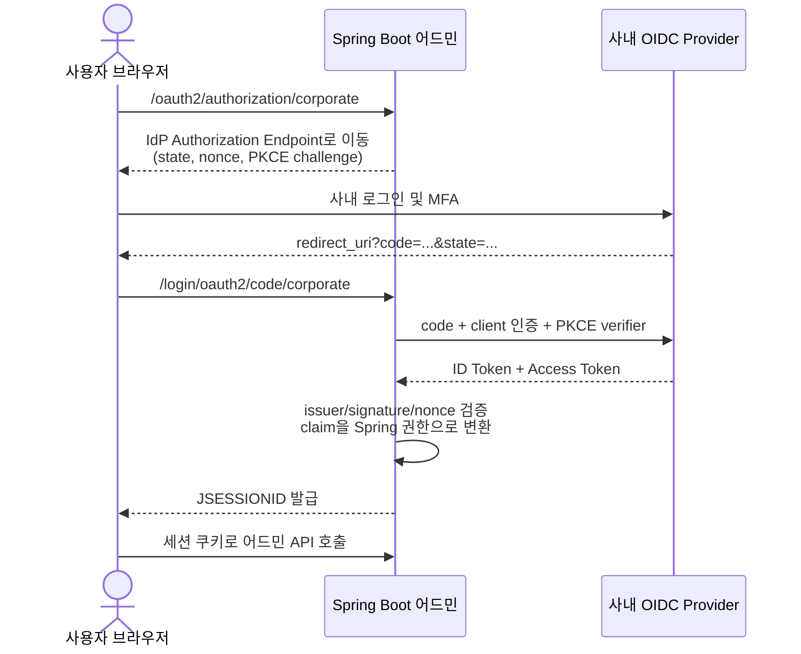

# PostgreSQL + Spring Boot 튜토리얼

로컬 Docker PostgreSQL에 연결해 JDBC URL, 계정, HikariCP 커넥션 풀 설정과 SQL 초기화를 실험할 수 있는 작은 프로젝트입니다.

## 사용 스택

- Java 21
- Spring Boot 4.1.1
- Spring JDBC (`JdbcTemplate`)
- Spring Security OAuth2 Client (OIDC SSO)
- PostgreSQL 17.5 (Docker)
- Gradle 9 Wrapper

## 1. PostgreSQL 실행

```bash
docker run -d --name postgres-tutorial-db -e POSTGRES_DB=tutorial -e POSTGRES_USER=test -e POSTGRES_PASSWORD=1234 -p 5432:5432 postgres:17.5
```

동일한 명령을 담은 스크립트도 사용할 수 있습니다.

```bash
./run-postgres.sh
```

기본 접속 정보는 다음과 같습니다.

| 항목 | 값 |
|---|---|
| Host | `localhost` |
| Port | `5432` |
| Database | `tutorial` |
| Username | `tutorial` |
| Password | `tutorial` |

컨테이너 상태와 로그는 다음 명령으로 확인합니다.

```bash
docker ps --filter name=postgres-tutorial-db
docker logs postgres-tutorial-db
```

## 2. 애플리케이션 실행

```bash
./gradlew bootRun
```

다른 접속 설정으로 실행하는 예시:

```bash
DB_URL='jdbc:postgresql://localhost:5433/my_database?sslmode=disable' \
DB_USERNAME='my_user' \
DB_PASSWORD='my_password' \
DB_POOL_MAX_SIZE=5 \
./gradlew bootRun
```

조정 가능한 값은 `src/main/resources/application.yml`에 모아 두었습니다.

## 3. 연결 확인

```bash
# PostgreSQL 서버/DB/사용자/스키마 정보
curl http://localhost:8080/api/database/info

# 초기 더미 데이터 조회
curl http://localhost:8080/api/messages

# 데이터 추가
curl -i -X POST http://localhost:8080/api/messages \
  -H 'Content-Type: application/json' \
  -d '{"code":"CUSTOM","content":"직접 추가한 메시지"}'

# DataSource를 포함한 Spring Boot health 확인
curl http://localhost:8080/actuator/health

# HikariCP 관련 metric 이름 확인
curl http://localhost:8080/actuator/metrics
```

`db/schema.sql`과 `db/data.sql`에 초기 SQL이 준비되어 있습니다. 현재 `spring.sql.init.mode`는 `never`이므로 필요할 때 `always`로 변경해 실행합니다. DML에는 `ON CONFLICT DO NOTHING`을 사용했으므로 재시작해도 초기 데이터가 중복되지 않습니다.

## 주요 실험 포인트

- JDBC URL에 `connectTimeout`, `socketTimeout`, `sslmode`, `ApplicationName` 등의 파라미터 추가
- HikariCP의 `maximum-pool-size`, `connection-timeout`, `idle-timeout`, `max-lifetime` 변경
- 잘못된 포트나 비밀번호를 넣고 시작/health 응답 관찰
- `logging.level.com.zaxxer.hikari: DEBUG`로 바꾸고 풀 생성/반납 로그 관찰
- `spring.sql.init.mode: never`로 바꾸고 SQL 자동 초기화 끄기

DB를 초기화하려면 컨테이너를 제거한 뒤 위의 `docker run` 명령을 다시 실행합니다.

```bash
docker rm -f postgres-tutorial-db
```

---

## 4. 사내 어드민 OIDC SSO 튜토리얼

이 예제는 서버가 브라우저 세션을 관리하는 사내 어드민 시스템을 가정합니다. 표준 OIDC Authorization Code Flow를 사용하므로 Keycloak, Microsoft Entra ID, Okta, Auth0, Google Workspace 또는 사내 OIDC Provider로 교체해도 애플리케이션 구조는 같습니다.

> SAML 전용 SSO는 프로토콜이 다르므로 이 설정을 그대로 사용할 수 없습니다. 실무 공급자가 SAML만 지원한다면 Spring Security SAML2 Service Provider 구성이 별도로 필요합니다.

### 전체 로그인 흐름



Spring Security가 authorization code 교환, `state`, `nonce`, ID Token 서명과 issuer 검증을 담당합니다. 이 프로젝트는 추가로 모든 로그인 요청에 PKCE를 적용합니다.

### 4.1 IdP에 애플리케이션 등록

SSO 담당자 또는 IdP 관리 화면에서 다음 값으로 Web/Confidential Client를 등록합니다.

| 항목 | 로컬 개발 값 |
|---|---|
| Application type | Web application / Confidential client |
| Redirect URI | `http://localhost:8080/login/oauth2/code/corporate` |
| Post logout URI | `http://localhost:8080/` |
| Grant type | Authorization Code |
| Scopes | `openid profile email` |
| 역할 claim | `roles`, `groups` 또는 공급자가 발급하는 claim |

Redirect URI는 대소문자, 포트, 경로와 마지막 슬래시까지 IdP 등록값과 정확히 일치해야 합니다. 운영 환경에서는 반드시 HTTPS 주소를 등록합니다.

IdP로부터 다음 세 값을 받으면 됩니다.

- Issuer URI: OIDC 공급자/테넌트를 식별하는 주소
- Client ID: 어드민 애플리케이션 식별자
- Client Secret: 서버에서만 보관할 자격증명

Issuer가 discovery를 지원하면 Spring이 `{issuer}/.well-known/openid-configuration`에서 authorization, token, JWKS, UserInfo 및 logout endpoint를 찾습니다.

### 4.2 SSO 프로필 실행

```bash
SPRING_PROFILES_ACTIVE=sso \
SSO_ISSUER_URI='https://idp.company.com/realms/company' \
SSO_CLIENT_ID='admin-client' \
SSO_CLIENT_SECRET='replace-with-secret' \
SSO_ROLES_CLAIM='roles' \
SSO_ADMIN_ROLE='ADMIN' \
DB_USERNAME='test' \
DB_PASSWORD='1234' \
./gradlew bootRun
```

Client Secret은 `application-sso.yml`이나 Git에 넣지 않습니다. 로컬에서는 환경변수, 운영에서는 Vault, AWS Secrets Manager, Kubernetes Secret 같은 비밀 저장소를 사용합니다.

브라우저에서 다음 주소를 엽니다.

```text
http://localhost:8080/
```

직접 로그인을 시작하는 주소:

```text
http://localhost:8080/oauth2/authorization/corporate
```

로그인 후 확인할 API:

| API | 필요한 권한 | 용도 |
|---|---|---|
| `GET /api/me` | 로그인 | 안전한 사용자 정보와 변환된 authority 확인 |
| `GET /api/messages` | 로그인 | 기존 일반 업무 API 예제 |
| `GET /api/admin/dashboard` | 관리자 역할 | 사내 어드민 권한 확인 |
| `GET /actuator/metrics` | 관리자 역할 | 운영 endpoint 보호 확인 |
| `GET /actuator/health` | 없음 | 민감한 상세정보 없는 health check |

`/api/me`는 ID Token이나 Access Token 원문을 반환하지 않습니다. 토큰을 브라우저 응답, 로그 또는 DB에 그대로 남기지 않는 것이 중요합니다.

### 4.3 공급자별 역할 claim 매핑

외부 역할은 `ROLE_` 접두사가 붙은 대문자 Spring authority로 변환됩니다. 예를 들어 `company-admin`은 `ROLE_COMPANY_ADMIN`이 됩니다.

```bash
# ID Token: { "roles": ["ADMIN", "USER"] }
SSO_ROLES_CLAIM='roles'
SSO_ADMIN_ROLE='ADMIN'

# Keycloak: { "realm_access": { "roles": ["company-admin"] } }
SSO_ROLES_CLAIM='realm_access.roles'
SSO_ADMIN_ROLE='company-admin'

# Entra ID 또는 Okta: { "groups": ["admin-group-id"] }
SSO_ROLES_CLAIM='groups'
SSO_ADMIN_ROLE='admin-group-id'
```

공급자별로 확인할 점:

- Keycloak: realm role과 client role 중 어느 것을 토큰에 넣을지 결정합니다. Client role은 보통 `resource_access.{client-id}.roles` 형태입니다.
- Microsoft Entra ID: tenant 전용 issuer를 사용하고, App Role 또는 group claim을 발급하도록 설정합니다. 그룹이 많은 사용자는 overage 처리도 확인해야 합니다.
- Okta/Auth0: Authorization Server에서 groups/roles custom claim을 ID Token에 포함합니다.
- Google: 기본 OIDC claim에는 일반적인 관리자 역할이 없으므로 Workspace 그룹 조회 또는 애플리케이션 DB 권한 모델이 추가로 필요합니다.

실무에서는 IdP 그룹명을 코드 여러 곳에서 직접 비교하기보다 `외부 그룹 → 애플리케이션 역할` 매핑 계층을 두는 편이 안전합니다. 이 튜토리얼은 이해를 위해 한 개의 admin role을 바로 매핑합니다.

### 4.4 인증과 인가를 구분하기

- 인증(Authentication): “이 사용자가 누구인가?”를 IdP와 ID Token으로 확인합니다.
- 인가(Authorization): “이 사용자가 어드민 기능을 실행해도 되는가?”를 role/group과 애플리케이션 정책으로 판단합니다.

SSO 로그인이 성공했다고 모든 어드민 API를 허용하면 안 됩니다. 이 프로젝트에서는 일반 API는 로그인 사용자에게, `/api/admin/**`와 민감한 Actuator API는 `SSO_ADMIN_ROLE` 사용자에게만 허용합니다. 역할 claim이 없거나 값이 다르면 로그인은 성공해도 관리자 API는 `403 Forbidden`이 됩니다.

### 4.5 세션, CSRF와 로그아웃

이 예제는 브라우저 기반 어드민이므로 Access Token을 JavaScript에 저장하지 않고 서버 세션과 `HttpOnly` 쿠키를 사용합니다. 상태를 변경하는 POST/PUT/PATCH/DELETE 요청에는 CSRF 토큰이 필요합니다. 화면의 로그아웃 버튼은 `/api/csrf`에서 토큰을 받은 뒤 `POST /logout`을 호출합니다.

운영 HTTPS 환경에서는 다음 값을 반드시 사용합니다.

```bash
SESSION_COOKIE_SECURE=true
```

로그아웃에는 두 단계가 있다는 점도 확인합니다.

1. 애플리케이션의 로컬 세션 종료
2. IdP 세션 종료(RP-Initiated Logout)

현재 구현은 IdP discovery metadata에 `end_session_endpoint`가 있으면 공급자 로그아웃까지 시도합니다. 공급자가 지원하지 않으면 로컬 세션만 종료될 수 있습니다.

### 4.6 자주 만나는 오류

| 증상 | 우선 확인할 내용 |
|---|---|
| `redirect_uri_mismatch` | IdP 등록 URI와 실제 callback URI가 완전히 같은지 확인 |
| `invalid_client` | Client ID, secret, client 인증 방식 확인 |
| 시작 시 issuer 연결 실패 | `SSO_ISSUER_URI`와 discovery endpoint, 인증서 신뢰 확인 |
| 로그인 성공 후 `403` | `/api/me`의 authority, 역할 claim 경로와 admin role 값 확인 |
| 로그인 반복/세션 유실 | 쿠키의 Secure/SameSite, 프록시 HTTPS 헤더, 서버 시간 확인 |
| 운영 callback이 HTTP로 생성됨 | reverse proxy의 `Forwarded`/`X-Forwarded-*` 전달과 신뢰 설정 확인 |
| 일부 사용자만 역할 누락 | 그룹 overage, claim 크기 제한, UserInfo/Graph API 필요 여부 확인 |
| 로그아웃 후 바로 재로그인됨 | 로컬 세션만 종료되고 IdP 세션은 남았는지 확인 |

OIDC 문제를 분석할 때 토큰 전문이나 Client Secret을 로그에 출력하지 않습니다. 필요한 경우 `iss`, `sub`, `aud`, `exp`, claim 이름 정도만 마스킹하여 확인합니다.

### 4.7 운영 적용 체크리스트

- [ ] OIDC Authorization Code Flow와 PKCE 사용
- [ ] tenant가 고정된 정확한 issuer 사용
- [ ] 운영 Redirect/Post Logout URI를 HTTPS로 정확히 등록
- [ ] Client Secret을 비밀 저장소에 보관하고 주기적으로 교체
- [ ] 최소 scope만 요청하고 Access/ID Token을 로그·브라우저·DB에 노출하지 않기
- [ ] 로그인 성공과 관리자 작업을 별도 감사 로그로 기록
- [ ] IdP 역할과 애플리케이션 권한의 매핑 및 승인 절차 정의
- [ ] 퇴사·부서 이동·권한 회수 시 기존 세션 만료 정책 정의
- [ ] 다중 인스턴스라면 Spring Session + Redis 같은 공유 세션 저장소 검토
- [ ] 세션 timeout, CSRF, Secure/HttpOnly/SameSite cookie 검증
- [ ] reverse proxy가 전달하는 forwarded header의 신뢰 경계 설정
- [ ] IdP 장애, JWKS key rotation, secret 만료 시나리오 테스트
- [ ] `401`과 `403`, 로그인 성공/실패, 관리자 변경 작업 모니터링
- [ ] 비상용 관리자 계정(break-glass)의 보관·승인·감사 절차 마련

사용자 생성/수정/퇴사 동기화는 로그인 프로토콜인 OIDC와 별도 문제입니다. 자동 프로비저닝이 필요하면 SCIM 또는 사내 인사 시스템 연동을 별도로 설계합니다.

### 참고 문서

- [Spring Security OAuth2 Login](https://docs.spring.io/spring-security/reference/servlet/oauth2/login/)
- [Spring Boot OAuth2 Client 설정](https://docs.spring.io/spring-boot/reference/security/oauth2.html)
- [Spring Security OIDC Logout](https://docs.spring.io/spring-security/reference/servlet/oauth2/login/logout.html)
- [OpenID Connect Core 1.0](https://openid.net/specs/openid-connect-core-1_0-18.html)
